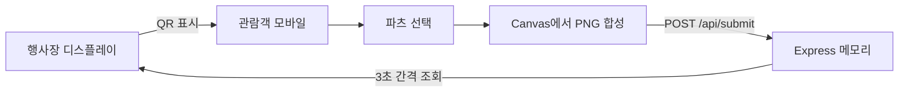

# char-maker

> QR로 관람객의 휴대전화와 행사장 디스플레이를 연결하는 인터랙티브 캐릭터 메이커

`char-maker`는 전시·행사 방문자가 별도 앱 설치 없이 캐릭터를 만들고, 완성한 결과를 공용 화면에 띄우는 참여형 웹앱입니다. 디스플레이의 QR을 스캔해 모바일 제작 화면에 접속하고, 의상·머리·손·액세서리를 조합해 전송하면 단일 Node 서버가 최신 캐릭터를 디스플레이에 전달합니다.

[모바일 UI 미리보기](https://char-maker-iota.vercel.app/mobile.html)

> Vercel 링크는 화면 체험용입니다. 현재 릴레이 상태는 서버 메모리에 저장되므로, 모바일과 디스플레이를 확실히 연결하려면 아래와 같이 하나의 Node 프로세스로 실행해야 합니다.

## 해결하려는 문제

전시 현장에서 관람객이 직접 만든 결과를 큰 화면에 보여주려면 참여 과정이 짧고 운영이 단순해야 합니다.

- 앱 설치나 회원가입 없이 QR 하나로 참여할 수 있어야 한다.
- 작은 모바일 화면에서도 파츠를 빠르게 비교하고 조합해야 한다.
- 완성 결과를 파일로 내려받거나 운영자에게 전달할 필요 없이 공용 화면에 보여줘야 한다.
- 행사장 내부 네트워크에서도 별도 프론트엔드 빌드 과정 없이 실행할 수 있어야 한다.

## 핵심 경험

| 화면 | 역할 |
| --- | --- |
| 디스플레이 | 모바일 접속용 QR과 최신 캐릭터를 애니메이션 배경 위에 표시 |
| 모바일 | 네 가지 카테고리의 파츠 선택, 실시간 미리보기, Canvas 이미지 합성 |
| Express 서버 | 정적 파일 제공, PNG 제출 검증, 최신 결과 조회, QR 생성 |

키보드 사용자도 각 파츠를 버튼으로 선택할 수 있으며, 현재 선택 상태와 전송 결과는 접근성 속성으로 전달됩니다.

## 동작 방식



1. 디스플레이가 현재 서버 주소의 `/mobile.html` QR을 생성합니다.
2. 관람객은 의상·머리·손·액세서리 PNG 레이어를 조합합니다.
3. 브라우저가 레이어를 2048×2048 Canvas에 합성해 PNG data URL로 전송합니다.
4. 디스플레이는 `/api/latest`를 조회해 새 결과를 최대 약 3초 안에 반영합니다.

## 로컬 실행

Node.js 22 이상이 필요합니다.

```bash
git clone https://github.com/0xMegg/char-maker.git
cd char-maker
npm ci
npm start
```

서버를 실행하면 터미널에 두 주소가 표시됩니다.

- 디스플레이: `http://localhost:3000/display.html`
- 모바일: `http://<로컬-IP>:3000/mobile.html`

디스플레이와 휴대전화를 같은 네트워크에 연결한 뒤 디스플레이 주소를 열고 QR을 스캔하면 됩니다. 방화벽이 켜져 있다면 Node.js의 로컬 네트워크 접근을 허용해야 합니다.

## API와 안전장치

| 경로 | 역할 | 검증 |
| --- | --- | --- |
| `POST /api/submit` | 완성된 캐릭터 저장 | PNG data URL만 허용, JSON 요청 8MB 제한 |
| `GET /api/latest` | 최신 캐릭터 조회 | 캐시 금지, 이미지와 타임스탬프 반환 |
| `GET /api/qr` | 모바일 주소 QR 생성 | `http`·`https` URL과 최대 길이 검증 |
| `GET /api/health` | 서버 상태 확인 | 캐시 없는 JSON 응답 |

응답에는 `X-Content-Type-Options`와 `Referrer-Policy`를 적용하며 Express 식별 헤더는 노출하지 않습니다.

## 검증

```bash
npm test
npm audit
```

Node 기본 테스트 러너로 다음 흐름을 검증합니다.

- 루트 리다이렉트와 정적 모바일 화면
- 보안 헤더와 상태 확인 API
- 최초 빈 상태와 제출 후 최신 이미지 조회
- 잘못된 이미지·JSON·QR 주소 거부

로컬 브라우저 점검에서는 모바일에서 조합한 캐릭터가 단일 Express 프로세스를 거쳐 디스플레이에 표시되는 전체 흐름을 확인했습니다.

## 기술 스택

- Node.js 22+, Express 4
- Vanilla HTML, CSS, JavaScript
- Canvas API 기반 PNG 레이어 합성
- `qrcode` 기반 접속 QR 생성
- CSS 애니메이션과 3초 polling
- Node test runner

프레임워크 없이 두 개의 정적 화면과 작은 API 서버로 구성해 행사장 노트북에서도 설치와 실행 단계를 최소화했습니다.

## 프로젝트 구조

```text
char-maker/
├── cards/               # 조합 가능한 PNG 파츠
├── public/
│   ├── mobile.html      # 모바일 제작 화면
│   └── display.html     # 공용 디스플레이 화면
├── test/server.test.js  # API·정적 화면 통합 테스트
├── server.js            # Express 서버와 인메모리 릴레이
└── vercel.json          # UI 미리보기 배포 설정
```

## 현재 운영 한계

최신 캐릭터는 서버 메모리에 한 건만 저장됩니다. 행사장 노트북에서 단일 프로세스로 실행할 때는 단순하고 빠르지만 다음 제약이 있습니다.

- 서버를 재시작하면 최신 캐릭터가 사라집니다.
- 여러 Node 프로세스나 서버리스 인스턴스 사이에서는 상태가 공유되지 않습니다.
- Vercel 배포는 모바일·디스플레이 UI를 볼 수 있지만 전체 릴레이를 보장하지 않습니다.

여러 인스턴스에서 운영하려면 Redis·Supabase Realtime 같은 공유 저장소나 지속 연결을 지원하는 WebSocket 서버로 릴레이 계층을 교체해야 합니다.

초기 프로토타입과 배포 시행착오는 [개발 기록](docs/blog/2026-04-09.md)에 정리되어 있습니다.
